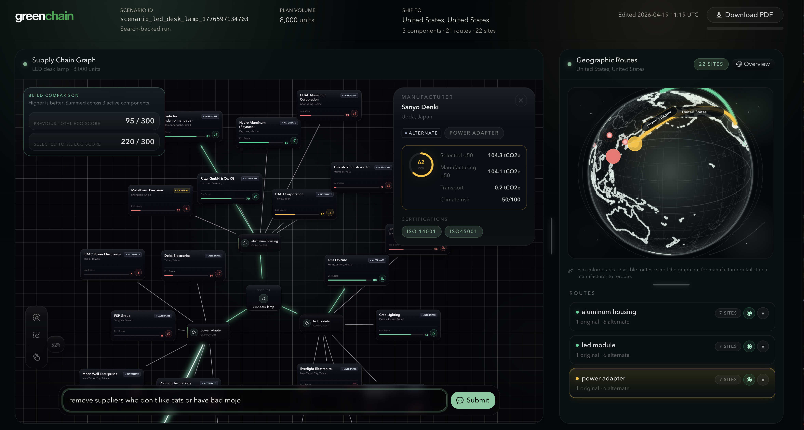
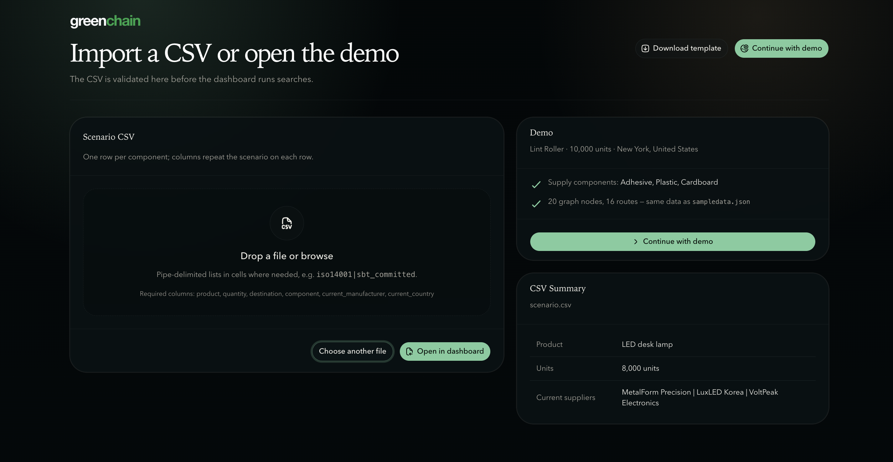
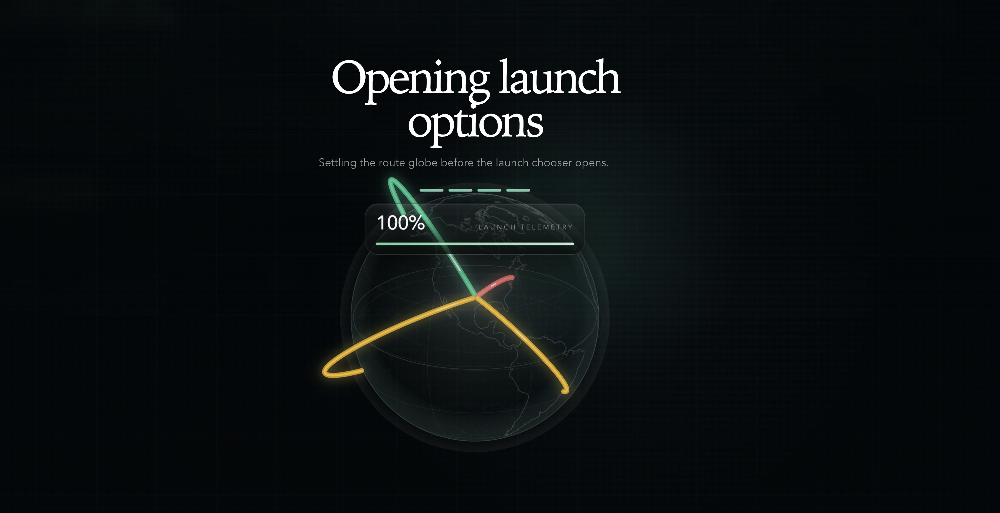
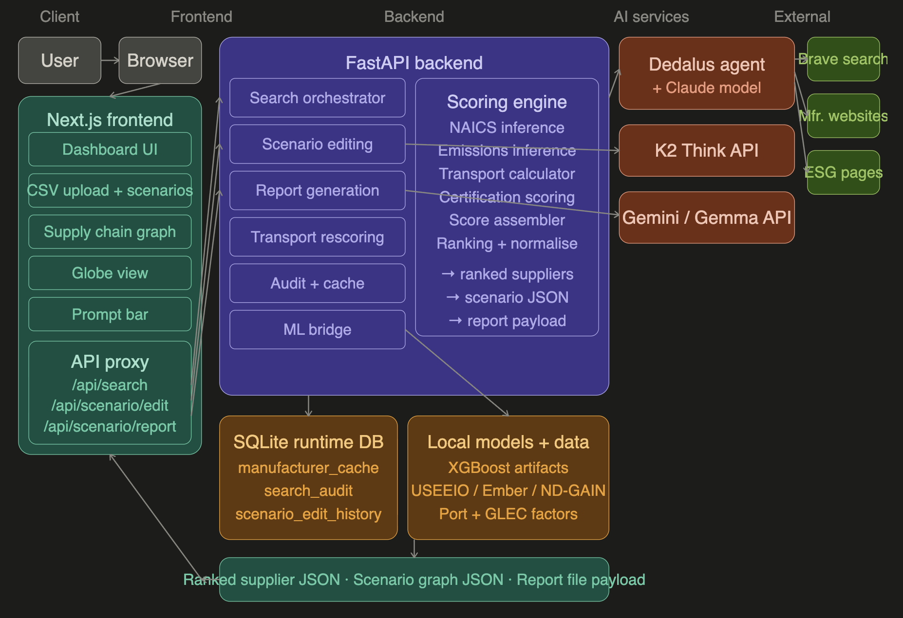
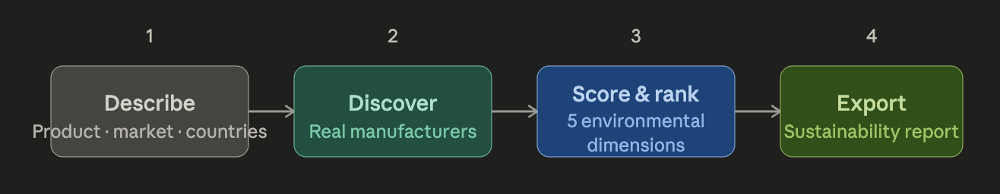

<div align="center">


# 🌿 GreenChain

### *Compare sourcing options before you place the order.*

**Type a product. Pick source countries. Choose a transport mode.**
**Get a ranked, cited, ML-scored comparison of real manufacturers — in under 60 seconds.**

[](https://www.hackprinceton.com/)
[](https://dedaluslabs.ai)
[](#tech-stack)
[](#license)

</div>

---

## 📖 Table of contents

1. [Why GreenChain](#-why-greenchain)
2. [What it does](#-what-it-does)
3. [Product demo](#-product-demo)
4. [Architecture](#-architecture)
5. [User journey](#-user-journey)
6. [The ML pipeline](#-the-ml-pipeline)
7. [Data sources](#-data-sources)
8. [Tech stack](#-tech-stack)
9. [Quickstart](#-quickstart)
10. [API reference](#-api-reference)
11. [Market & opportunity](#-market--opportunity)
12. [Roadmap](#-roadmap)
13. [Team](#-team)
14. [License](#-license)

---

## 🌍 Why GreenChain

> **Global supply chains are responsible for over 60% of corporate greenhouse gas emissions** — yet the vast majority of procurement decisions are made with **zero visibility** into those emissions. Existing ESG software costs upwards of $50,000/year, requires months of onboarding, and is built for compliance teams — not for the fast, real-world decisions that procurement managers make every week.

<div align="center">

<br/>
<sub><i>The landing page — GreenChain frames the decision before a single PO is cut.</i></sub>
</div>

<br/>

Procurement managers, ESG leads, and climate-aware founders face the same three problems:

| Problem | Today's reality | GreenChain's answer |
|---|---|---|
| **No common yardstick.** | Emissions disclosures are inconsistent, self-reported, and often missing. | We normalize across USEEIO, Ember, GLEC, and ND-GAIN to a single composite score. |
| **Manual research.** | Analysts spend days reading sustainability PDFs manufacturer by manufacturer. | A Dedalus agent swarm does it in parallel, in under a minute. |
| **No counterfactuals.** | *"What if we switched to rail?"* requires a new spreadsheet. | Flip the transport toggle — the ranking re-computes instantly, client-side. |

---

## ⚡ What it does

**One sentence:** You describe what you're sourcing — product, destination market, quantity, candidate countries, and transport mode — and GreenChain automatically discovers real manufacturers for the components, scores them across five environmental dimensions, and ranks them on a live dashboard.

<div align="center">

<br/>
<sub><i>The live dashboard: supply-chain graph on the left, per-supplier drill-down in the middle, animated geographic routes on the right.</i></sub>
</div>

### 🔑 Core capabilities

- 🌐 **Interactive globe view** — manufacturers pinned on a 3D globe with live-animated transport arcs.
- 🕸️ **Force-directed supply chain graph** — see the product → country → manufacturer topology update as agents stream in results.
- 🤖 **Agent swarm discovery** — Dedalus orchestrates parallel `web_search`, `fetch_url`, and custom Python tools for every country in the query.
- 📊 **XGBoost quantile scoring** — q10 / q50 / q90 emissions intervals trained on 1,016 NAICS industries × 179 countries.
- ⚖️ **Adjustable weight sliders** — users re-weight the 5 scoring dimensions and see rankings shift live.
- 🚢 **Instant transport rescore** — flipping sea → air runs the GLEC formula in the browser, no network round-trip.
- 📄 **Downloadable memo** — a final agent writes a citable procurement recommendation.

---

## 🎬 Product demo

> Screenshots below are captured from the production build. To explore interactively, follow the [Quickstart](#-quickstart).

### 1. Import a scenario (or open the demo)

<div align="center">

<br/>
<sub><i>Drop a scenario CSV (one row per component) or click <b>Continue with demo</b> to load a pre-seeded 20-node graph over 16 routes.</i></sub>
</div>

### 2. Launch telemetry

<div align="center">

<br/>
<sub><i>While the agent swarm runs, a globe pre-renders the route topology — the UI never shows a spinner in a vacuum.</i></sub>
</div>

### 3. The live dashboard

<div align="center">

</div>

The dashboard is a resizable three-pane workspace:

| Pane | What lives there |
|---|---|
| **🕸️ Supply Chain Graph (left)** | Force-directed graph: root = product, mid-nodes = components, leaves = manufacturers. Edges color by env-rating; nodes grow with total tCO₂e as scoring streams in. |
| **🔍 Supplier drill-down (center)** | Click any node for a radial score breakdown, certifications, disclosure status, and alternate suppliers for the same component. |
| **🌐 Geographic Routes (right)** | 3D globe (Three.js) with animated transport arcs whose color encodes transport mode and whose travel speed matches the chosen mode. |
| **💬 Prompt bar (bottom)** | *"remove suppliers who don't like cats or have bad mojo"* — natural-language filter over the current result set, routed to a second-pass scenario editor. |

> Key files: [`components/dashboard/interactive-globe.tsx`](frontend/components/dashboard/interactive-globe.tsx), [`components/dashboard/supply-chain-graph.tsx`](frontend/components/dashboard/supply-chain-graph.tsx), [`components/dashboard/prompt-bar.tsx`](frontend/components/dashboard/prompt-bar.tsx).

---

## 🏗️ Architecture

<div align="center">

</div>

<br/>

GreenChain is a **thin FastAPI orchestrator in front of a Dedalus agent swarm**, with all ML scoring and data lookups happening in-process post-swarm.

```
┌─────────────────────────────────────────────────────────────────────┐
│                          NEXT.JS FRONTEND                            │
│  Globe (Three.js)   Supply-chain graph (D3)   Prompt bar + results  │
└─────────────────────────────┬───────────────────────────────────────┘
                              │ POST /search  (product, countries, mode)
                              ▼
┌─────────────────────────────────────────────────────────────────────┐
│                        FASTAPI BACKEND                               │
│                   (pass-through orchestrator)                        │
└─────────────────────────────┬───────────────────────────────────────┘
                              │ runner.run(input, model, mcp_servers, tools)
                              ▼
┌─────────────────────────────────────────────────────────────────────┐
│                    DEDALUS AGENT SWARM                               │
│                                                                      │
│   🔎 Discovery agent      ─► brave-search-mcp                       │
│   📜 Certification agent  ─► fetch_url (optional Dedalus Machine)   │
│   🧮 Tool-using agent     ─► lookup_emission_factor                 │
│                              calculate_transport_emissions           │
│                              score_certifications                    │
│   ✍️  Memo agent          ─► writes procurement recommendation       │
└─────────────────────────────┬───────────────────────────────────────┘
                              │ raw JSON: manufacturers + certs + URLs
                              ▼
┌─────────────────────────────────────────────────────────────────────┐
│                     ML SCORING PIPELINE (in FastAPI)                │
│                                                                      │
│   XGBoost quantile regression (q10/q50/q90) — manufacturing tCO₂e   │
│   GLEC framework × port distance  ─ transport tCO₂e                 │
│   Ember grid carbon ─ local electricity intensity                   │
│   ND-GAIN climate risk ─ physical-risk adjustment                   │
│   Certification multiplier + composite 0–100 normalizer             │
└─────────────────────────────┬───────────────────────────────────────┘
                              │ SSE stream of scored manufacturers
                              ▼
                         Back to frontend
```

### Why this shape?

- **Dedalus does all agent orchestration.** No hand-rolled tool-use loops, no asyncio semaphores. One `runner.run()` call per search.
- **ML is in-process, not agentic.** Scoring is deterministic and reproducible; judges and investors can audit the formula.
- **Transport toggle never re-hits the backend.** The GLEC factor table lives in the browser — flipping sea → air is sub-frame.
- **Optional Dedalus Machine isolation.** Set `GREENCHAIN_USE_DEDALUS_MACHINE=1` to run the agent's URL fetches inside a KVM-isolated Linux VM (provisioned at startup, deleted on shutdown). Falls back to local `httpx` on any error.

---

## 🧭 User journey

<div align="center">

</div>

<br/>

1. **Land** → cinematic hero page frames the problem.
2. **Launch** → onboarding overlay collects product, countries, destination, transport mode.
3. **Search** → agents stream results into the globe, graph, and result drawer in real time.
4. **Compare** → flip transport modes, adjust weight sliders, filter to only certified suppliers.
5. **Decide** → download the auto-generated recommendation memo with cited sources.

---

## 🧠 The ML pipeline

| Dimension | Method | Source |
|---|---|---|
| **Manufacturing emissions** | XGBoost quantile regression (q10 / q50 / q90), features: NAICS code × ISO country × grid carbon. | USEEIO v1.3 (1,016 NAICS) + Ember + CDP supply-chain disclosures. |
| **Transport emissions** | GLEC factor (kgCO₂e/tonne-km) × shipment weight × port-to-port distance lookup. | Smart Freight Centre GLEC v2.0 + SeaRates port matrix. |
| **Grid carbon** | Per-country electricity carbon intensity (gCO₂/kWh). | Ember Climate (179 countries). |
| **Certifications** | Weighted multiplier across ISO 14001, CDP A/B/C, SBTi committed/achieved, B Corp. | Parsed from manufacturer sustainability pages by agent. |
| **Climate risk** | Physical risk (flood, heat stress) per-country. | Notre Dame GAIN (167 countries). |

The composite is a weighted 0–100 score where each dimension's weight is user-adjustable in the UI. Default weights:

```python
DEFAULT_WEIGHTS = {
    "manufacturing_emissions": 0.40,
    "transport_emissions":     0.25,
    "grid_carbon":             0.20,
    "certifications":          0.10,
    "climate_risk":            0.05,
}
```

> Models are vendored under [`backend/ml_runtime/models/`](backend/ml_runtime/models/) (~9 MB) and loaded once at FastAPI startup. Training code lives in [`backend/ml_runtime/ml/`](backend/ml_runtime/ml/).

---

## 📚 Data sources

Every number in GreenChain traces back to a free, citable, public dataset — so when an investor, auditor, or judge asks *"how do you know this?"* we have an answer.

| Dataset | Scope | Link |
|---|---|---|
| **EPA USEEIO v1.3** | 1,016 NAICS industries × emission factors (tCO₂e / $1M) | [epa.gov/useeio](https://www.epa.gov/land-research/us-environmentally-extended-input-output-useeio-technical-content) |
| **Ember Climate** | 179-country electricity grid carbon intensity | [ember-climate.org](https://ember-climate.org/data/data-tools/data-explorer/) |
| **GLEC Framework v2.0** | Global Logistics Emissions Council transport factors | [smartfreightcentre.org](https://www.smartfreightcentre.org/en/how-to-implement-items/what-is-glec-framework/) |
| **ND-GAIN Country Index** | 167-country climate vulnerability & readiness | [gain.nd.edu](https://gain.nd.edu/our-work/country-index/) |
| **CDP Supply Chain** | Corporate emission disclosures (training data) | [cdp.net](https://www.cdp.net/en/supply-chain) |

---

## 🛠️ Tech stack

**Frontend**
- ⚛️ **Next.js 16** (App Router, Turbopack dev / Webpack build)
- 🎨 **Tailwind v4** + **shadcn/ui** + **Radix UI** primitives
- 🌐 **Three.js** interactive globe
- 🕸️ D3-style force-directed graph (custom, no d3 dep)
- 📦 React 19, React Server Components, SSE streaming

**Backend**
- 🐍 **FastAPI** (async) + **Uvicorn**
- 🤖 **Dedalus Labs** `AsyncDedalus` / `DedalusRunner` — agent orchestration
- 🔎 **Brave Search MCP** for manufacturer discovery
- 🧠 **XGBoost** quantile regression + scikit-learn
- 🗄️ **SQLite** for reference tables (USEEIO, Ember, GLEC, port distances, ND-GAIN)
- 🔒 Optional **Dedalus Machines** (KVM-isolated VM) for sandboxed `fetch_url`

**Models**
- `anthropic/claude-sonnet-4-6` via Dedalus passthrough (discovery + certification agents)
- **K2 Think V2** — two-pass scenario editor (parse-safe JSON mutations)
- **Gemini** — used in the memo-generation pipeline
- XGBoost q10/q50/q90 emissions model (vendored)

---

## 🚀 Quickstart

### Prerequisites

- Python 3.11+
- Node.js 20+
- API keys for **Dedalus**, **Anthropic**, and **Brave Search** (free tiers cover the demo)

### Backend

```bash
cd backend
cp .env.example .env              # fill in DEDALUS_API_KEY, ANTHROPIC_API_KEY, BRAVE_API_KEY
python3 -m venv .venv
source .venv/bin/activate
pip install -r requirements.txt   # installs dedalus-labs, fastapi, xgboost, …
cd ..                             # IMPORTANT: run uvicorn from repo root
uvicorn backend.main:app --reload --port 8000
```

Open **http://localhost:8000/docs** for the interactive Swagger UI.

> **Troubleshooting `No module named 'dedalus_labs'`:** the process is using a Python different from where you ran `pip install`. Activate `backend/.venv` in the shell you run `uvicorn` from (or point your IDE interpreter to it).

### Frontend

```bash
cd frontend
npm install
npm run dev                        # http://localhost:3000
```

The frontend expects the backend at `http://localhost:8000`.

### Environment variables (`backend/.env`)

| Key | Where to get it | Required? |
|---|---|---|
| `DEDALUS_API_KEY` | [dedaluslabs.ai](https://dedaluslabs.ai) | ✅ |
| `ANTHROPIC_API_KEY` | [console.anthropic.com](https://console.anthropic.com) | ✅ |
| `BRAVE_API_KEY` | [api.search.brave.com](https://api.search.brave.com/app/keys) (free: 2k q/mo) | ✅ |
| `GREENCHAIN_USE_DEDALUS_MACHINE` | Set to `1` to sandbox `fetch_url` in a Dedalus Machine VM | ❌ |
| `GREENCHAIN_ALLOW_MOCK_COMPONENT_SEARCH` | Set to `1` to fall back to mock manufacturers when keys are missing (demo-only) | ❌ |

If `/search` returns **502**, read the `detail` message — it's almost always a missing key or an upstream Dedalus / network failure.

---

## 🔌 API reference

| Method | Path | Purpose |
|---|---|---|
| `GET`  | `/health` | Liveness probe. |
| `POST` | `/search` | Run the Dedalus swarm + ML scoring; returns a ranked list. |
| `POST` | `/score` | Score pre-collected candidates (skips the agent call). |
| `POST` | `/rescore-transport` | Recompute transport emissions under a different mode. |

### Example

```bash
curl -X POST http://localhost:8000/search \
  -H "Content-Type: application/json" \
  -d '{
    "product": "cotton t-shirts",
    "quantity": 10000,
    "destination": "US",
    "countries": ["CN", "PT", "BD"],
    "transport_mode": "sea",
    "target_count": 9
  }'
```

Two search modes:

- **Per-country** — pass a non-empty `countries` array; the agent finds manufacturers in each.
- **Global** — pass `countries: []`; the agent picks countries itself, biased toward geographic diversity.

### Demo scenarios

| # | Product | Countries | Highlight |
|---|---|---|---|
| 1 | Cotton t-shirts (10k units) | CN, PT, BD | Portugal ranks #1 on sea. Flip to air → China transport emissions jump ~55×. |
| 2 | Circuit boards (5k) | TW, VN, DE | Filter to `iso14001` only — watch results prune live. |
| 3 | Automotive components (20k) | DE, MX, IN | Road vs. rail toggle changes the ranking on short-haul routes. |

---

## 💼 Market & opportunity

### The addressable market

- 📈 **ESG software is a $1.4B → $4.3B market by 2027** (Verdantix, 2024).
- 🏭 **Scope 3 reporting is mandatory** under the EU CSRD (~50k companies in scope from FY2024) and California SB 253.
- 📦 **Procurement teams make ~$13T/year in global sourcing decisions** (McKinsey, 2023) — and none of the incumbents (EcoVadis, CDP, Watershed) give a live, counterfactual-ready comparison.

### Where GreenChain wins

| | GreenChain | EcoVadis | Watershed | Manual spreadsheet |
|---|---|---|---|---|
| Time to first ranked list | **~45s** | Weeks | Days | Days–weeks |
| Counterfactual transport mode toggle | **✅ instant** | ❌ | ❌ | ❌ |
| Cited public data sources | **✅ 5 datasets** | Partial (private scores) | Partial | Varies |
| Agent-driven auto-discovery | **✅ Dedalus swarm** | ❌ (seller-submitted) | ❌ | ❌ |
| Works without supplier onboarding | **✅** | ❌ | ❌ | ✅ |

### Who we serve

- **Procurement & sourcing managers** at mid-market brands.
- **ESG / sustainability leads** under CSRD or SB 253 reporting pressure.
- **Climate-aware founders** making early sourcing decisions that lock in emissions for years.
- **Private-market investors** doing ESG due diligence on portfolio companies.

---

## 🗺️ Roadmap

- [x] **v0.1 — HackPrinceton 2026** — live agent swarm, XGBoost scoring, interactive globe, transport toggle.
- [ ] **v0.2 — Cost integration.** Layer in unit cost and lead time so procurement teams can see the Pareto frontier of environmental vs. financial performance.
- [ ] **v0.3 — Richer certification signals.** Beyond ISO 14001 / CDP / SBTi — parse TCFD, CSRD disclosures, and SBTi target vintages.
- [ ] **v0.4 — Deeper Scope 3 upstream tracing.** Agents follow bill-of-materials one hop deeper into Tier-2 suppliers.
- [ ] **v0.5 — Real-time grid carbon.** Swap annual Ember averages for live marginal-intensity APIs (Electricity Maps, WattTime).
- [ ] **v0.6 — CSRD / SB 253 export.** Map results to required disclosure schemas for audit-ready output.
- [ ] **v1.0 — Enterprise pilot** with 3 design-partner procurement teams; SSO + audit log; hosted Dedalus Machines per tenant.

---

## 👥 Team & recognition

Built in 36 hours at **HackPrinceton Spring 2026** for the Dedalus track *"Best agent swarm hosted on Dedalus Containers."* Full project write-up on [Devpost](https://devpost.com/software/greenchain-1xglhu).

### What we learned building it

> *"Agent reliability is an engineering problem, not a prompting problem."* The hardest single problem was **signal quality** — Brave Search returns a mix of real manufacturers, directory listings, trade aggregators, and SEO-spam factories, so filtering and disambiguation had to be baked into the swarm itself. Working with fragmented environmental datasets (USEEIO, Ember, GLEC, ND-GAIN, CDP) in one pipeline taught us how much normalization work sits between "public data exists" and "you can act on it."

### What we're proud of

> We shipped a **complete, end-to-end product**. The XGBoost model generalizes meaningfully, the Dedalus architecture came out exactly as designed, and the K2 Think V2 two-pass scenario editor produces parse-safe, internally-consistent JSON reliably.

Interested in investing, piloting, or contributing? **Open an issue** or reach out via the contact on the team's GitHub profiles.

---

## 📄 License

MIT — see [`LICENSE`](LICENSE) if present; otherwise treat as MIT for the hackathon submission.

---

<div align="center">

### 🌱 Every sourcing decision is a climate decision. GreenChain makes it an informed one.

<sub>Made with ☕ at HackPrinceton Spring 2026 · Powered by <a href="https://dedaluslabs.ai">Dedalus Labs</a> + <a href="https://www.anthropic.com">Anthropic Claude</a></sub>

</div>
